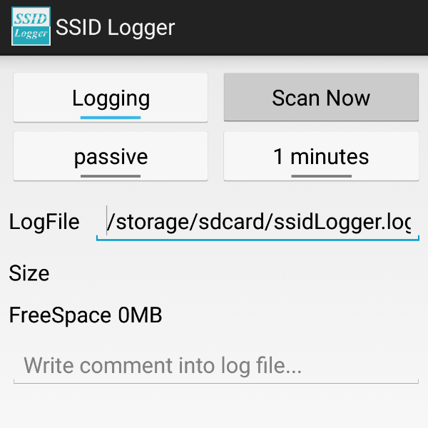

ssidLogger
==========

 SSID logger - an Android app for position tracking, target to logging without GPS/network access and low battery usage

**Features**

* SSID logging
 * low battery usage
 * no network required
 * logging scanned Wi-Fi SSID/BSSID and timestamp
* Major UI
 * no tabs / dropdown / menu , all in one page
 * change log file name
 * add comment into log
 * start/stop recording
 * active scanning wifi every 1 minutes or 30 seconds
 * passive scanning wifi with OS default interval

**Why you need this**

* **NO NETWORKS REQUIRED** - good when you travel without 3G/4G networks
* **NO GPS** - good when you indoor
* **LOW BATTERY USAGE** - when we do not use gps nor nerworks, the power consumption will be very low

HOW TO USE
==========

First of all, you should be able to build an Android project and install this on your Android device.

* **Logging** Toggle to enable logging or disable logging.
* **Scan Now** Button to do 1 time wifi scanning and write to log file.
* **passive** Toggle to enable or disable a interval timer to active scan wifi. Enable this if you wanna higher frequency of wifi scan than OS default. You can not change this when logging is enabled.
* **1 minutes** Toggle to choose active scan fequency from every 1 minutes or every 30 seconds. You can not change this when logging is enabled.
* **LogFile** change the logfile name, default will be your sdcard_directory/ssidLogger.log
* **Size** display current logfile size
* **FreeSpace** display current sdcard free space
* **Comment** write one line of comment into log file

Generate GPX
============

We provides a perl script to generate gpx from the log file.

some API reference.... (should pick 1 free/unlimited solution)
* http://www.openbmap.org/api/openbmap_api.php5
* http://orwelliantremors.blogspot.tw/2010/12/mobile-80211-parole-bracelet-for-man-in.html
* http://coderrr.wordpress.com/2008/09/10/get-the-physical-location-of-wireless-router-from-its-mac-address-bssid/
* https://developers.google.com/maps/documentation/business/geolocation/
* this works: https://maps.googleapis.com/maps/api/browserlocation/json?browser=firefox&sensor=true&wifi=mac:78:cd:8e:a6:f4:c9|ss:-82
  * ref: https://milo2012.wordpress.com/2012/02/23/geolocation-via-wireless-access-points/
* https://wigle.net/search
  * this limited 50 query per day and require account
